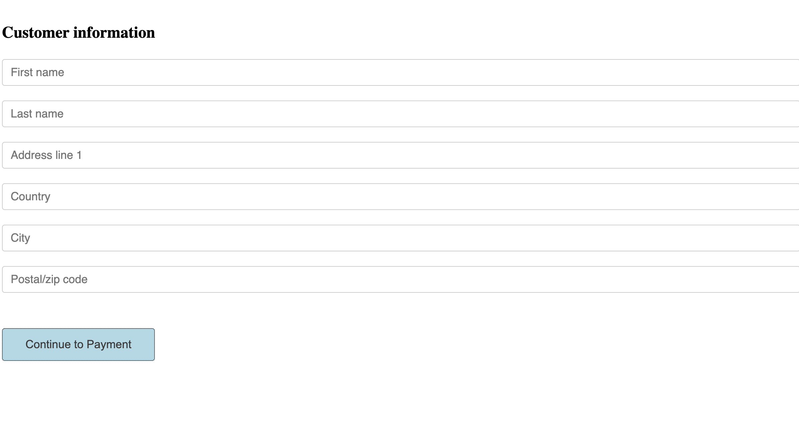
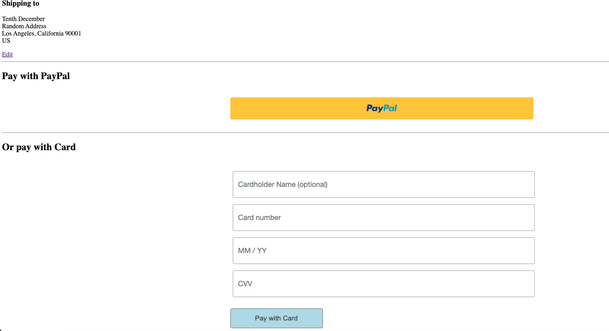
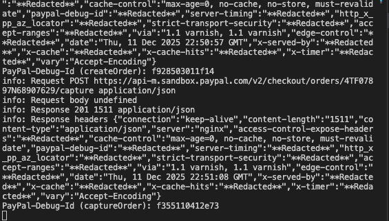
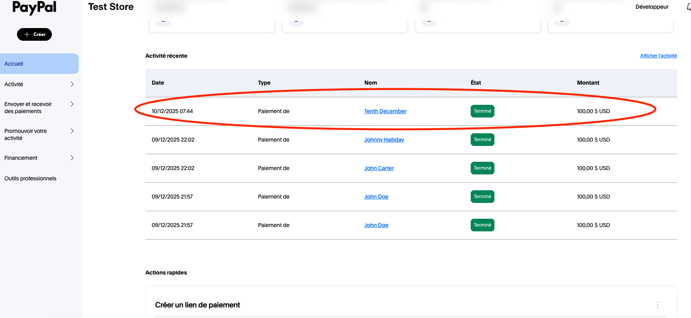
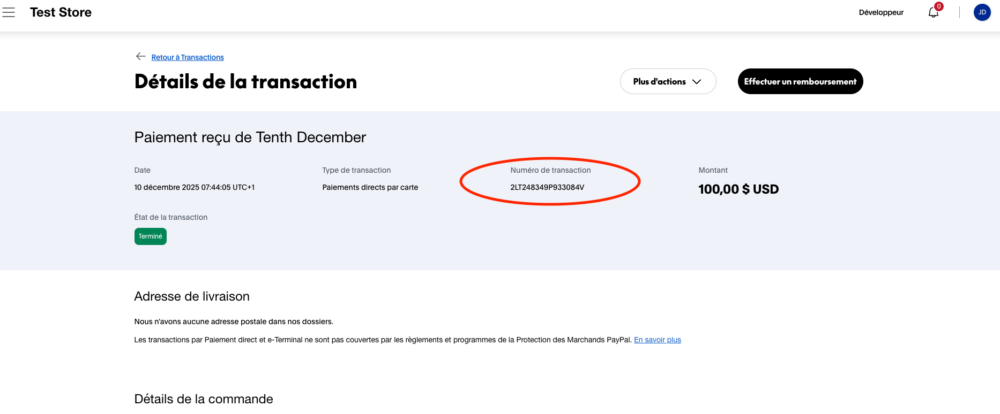
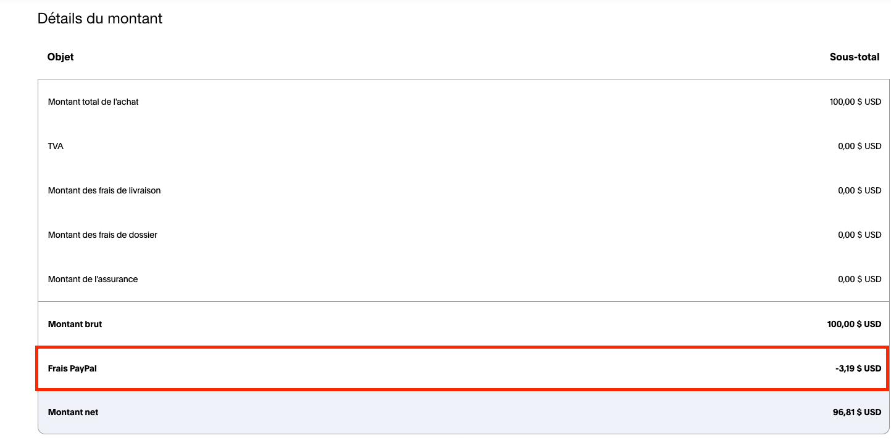

# PayPal Integration - Phase 2: Card Fields

## Overview

Extension of Phase 1 adding credit/debit card payments via PayPal Card Fields (hosted fields). Customers can now pay with PayPal button OR enter card details directly.

Same backend API as Phase 1 - only frontend changes to support both payment methods.

```
Frontend (PayPal Button OR Card Fields) → Express Routes → PayPal SDK → PayPal REST API
```

## Flow

### PayPal Button Flow

Same as Phase 1.

### Card Fields Flow

1. Customer fills checkout form
2. Customer redirected to payment page
3. Customer enters card details in hosted fields
4. Frontend calls `POST /api/orders` → creates order
5. Frontend submits card via `cardField.submit()`
6. Frontend calls `POST /api/orders/:id/capture` → captures payment
7. Payment complete, confirmation displayed

## Tech Stack

- **Frontend**: HTML, JavaScript, PayPal JS SDK (Buttons + Card Fields)
- **Backend**: Node.js, Express, @paypal/paypal-server-sdk
- **API**: PayPal Orders API v2

## Setup

### 1. Install dependencies

```bash
cd server/node
npm install
```

### 2. Configure environment

Add your PayPal credentials to your shell config file (`~/.zshrc` or `~/.bashrc`):

```bash
export PAYPAL_CLIENT_ID="your_client_id"
export PAYPAL_CLIENT_SECRET="your_client_secret"
```

Then reload the config:

```bash
source ~/.zshrc
# or
source ~/.bashrc
```

### 3. Run server

```bash
npm start
```

### 4. Open frontend

```bash
npm start
```

Then click on

```
http://localhost:3000/
```

## API Endpoints

Same as Phase 1 - no backend changes required.

| Method | Endpoint                       | Description         |
| ------ | ------------------------------ | ------------------- |
| POST   | `/api/orders`                  | Create PayPal order |
| POST   | `/api/orders/:orderID/capture` | Capture payment     |

## Screenshots

### Checkout Form



### Payment Page



### Payment Success


### Capture call



### Sandbox Dashboard





### PayPal fees Merchant side



## Key Code: Card Fields

```javascript
const cardField = paypal.CardFields({
  createOrder: () => {
    return fetch("/api/orders", {
      method: "POST",
      headers: { "Content-Type": "application/json" },
      body: JSON.stringify({ cart: [{ id: "product-1", quantity: 1 }] }),
    })
      .then((res) => res.json())
      .then((order) => order.id);
  },

  onApprove: (data) => {
    return fetch(`/api/orders/${data.orderID}/capture`, {
      method: "POST",
    })
      .then((res) => res.json())
      .then((orderData) => {
        console.log("Card payment captured", orderData);
      });
  },
});

// Render hosted fields
cardField.NameField().render("#card-name-field-container");
cardField.NumberField().render("#card-number-field-container");
cardField.ExpiryField().render("#card-expiry-field-container");
cardField.CVVField().render("#card-cvv-field-container");
```

## Test Cards (Sandbox)

Generate random card information on https://developer.paypal.com/tools/sandbox/card-testing/
