# PayPal Integration - Phase 1: PayPal Buttons

## Overview

Basic PayPal checkout integration using the PayPal JavaScript SDK and Server SDK.

The frontend sends HTTP requests via `fetch` to the Express backend. The backend uses the PayPal Server SDK to call PayPal REST APIs for order creation and payment capture.

```
Frontend → Express Routes → PayPal SDK → PayPal REST API
```

## Flow

1. Customer clicks PayPal button
2. Frontend calls `POST /api/orders` → creates order via PayPal API
3. PayPal popup opens for customer authentication
4. Customer approves payment
5. Frontend calls `POST /api/orders/:id/capture` → captures payment via PayPal API
6. Payment complete, confirmation displayed

## Tech Stack

- **Frontend**: HTML, JavaScript, PayPal JS SDK
- **Backend**: Node.js, Express, @paypal/paypal-server-sdk
- **API**: PayPal Orders API v2

## Setup

### 1. Install dependencies

```bash
cd server/node
npm install
```

### 2. Configure environment

Add your PayPal credentials to your shell config file (`~/.zshrc` or `~/.bashrc`):

```bash
export PAYPAL_CLIENT_ID="your_client_id"
export PAYPAL_CLIENT_SECRET="your_client_secret"
```

Then reload the config:

```bash
source ~/.zshrc
# or
source ~/.bashrc
```

### 3. Run server

```bash
npm start
```

### 4. Open frontend

```bash
npm start
```

Then click on

```
http://localhost:3000/
```

## API Endpoints

| Method | Endpoint                       | Description             |
| ------ | ------------------------------ | ----------------------- |
| POST   | `/api/orders`                  | Create PayPal order     |
| POST   | `/api/orders/:orderID/capture` | Capture payment         |
| GET    | `/api/orders/:orderID`         | Get order details       |
| PATCH  | `/api/orders/:orderID`         | Update order (shipping) |

## Screenshots

### Checkout Page

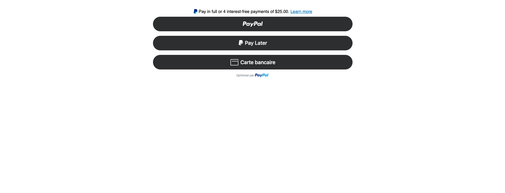

### PayPal Popup

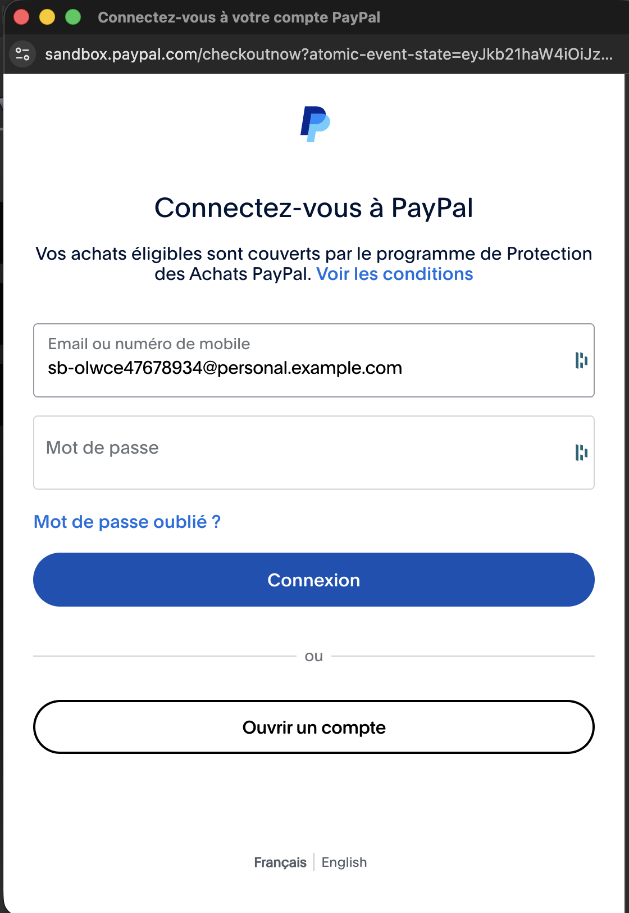

### Review Page

#### Marseille

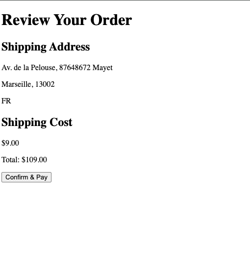

#### Paris

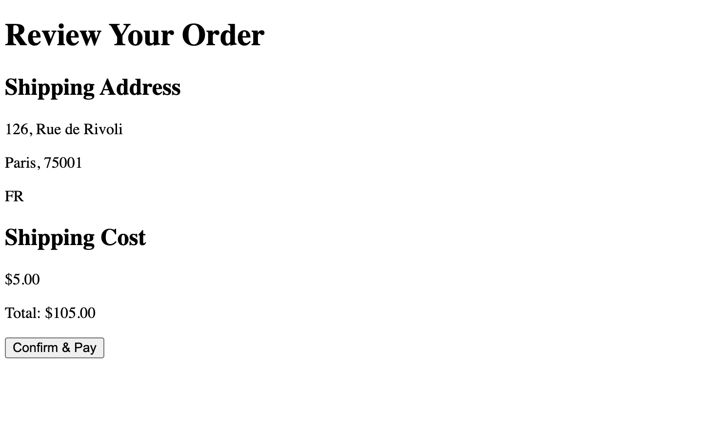

### Payment Success

#### Marseille

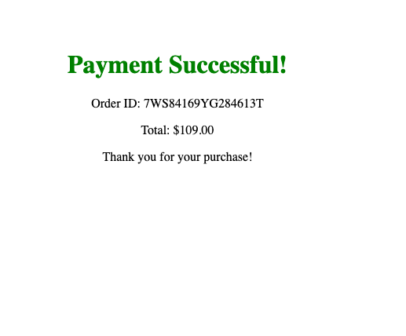

#### Paris

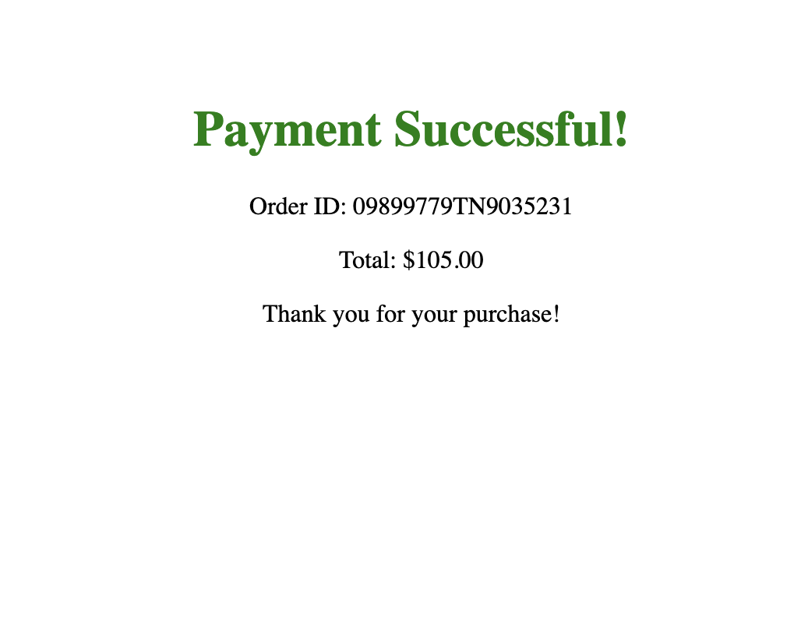

### Sandbox Dashboard

#### Customer Marseille

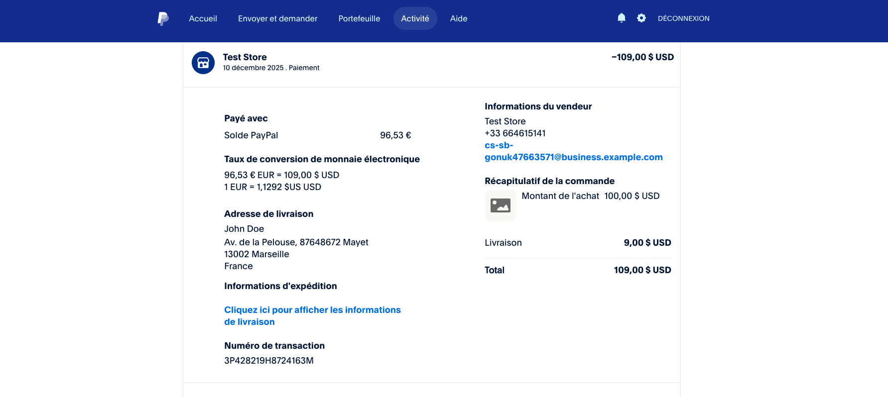

#### Merchant Marseille

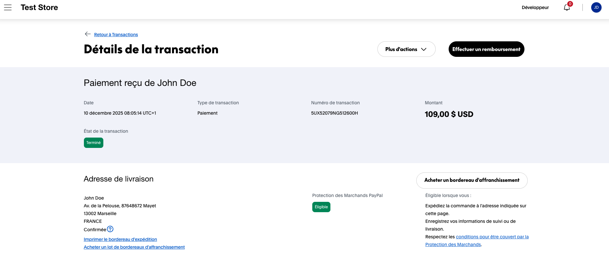

#### Customer Paris

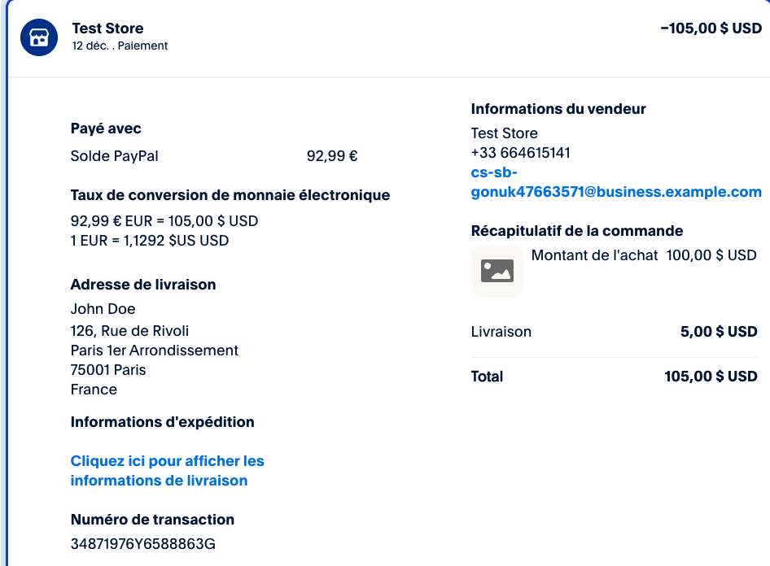

#### Merchant Paris

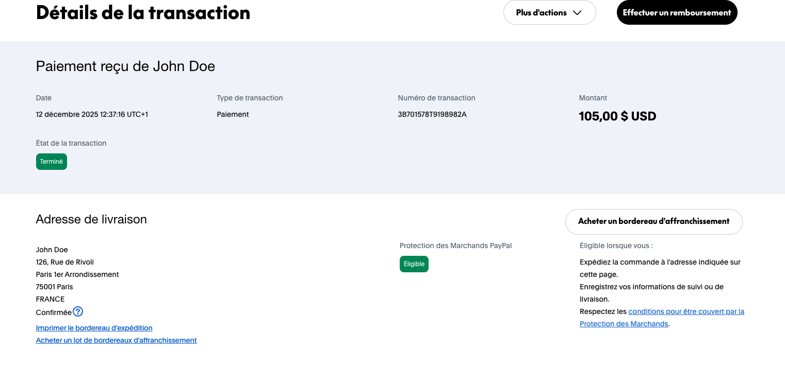

## Debugging

The server logs `PayPal-Debug-Id` for each API call. Use this ID when contacting PayPal Support.

Example:

### createOrder API Call

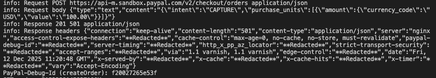

### getOrder API Call

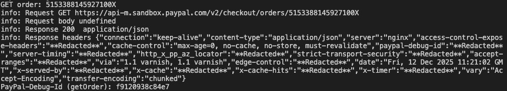

### patchOrder API Call

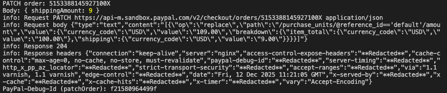

### captureOrder API Call

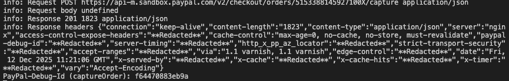
