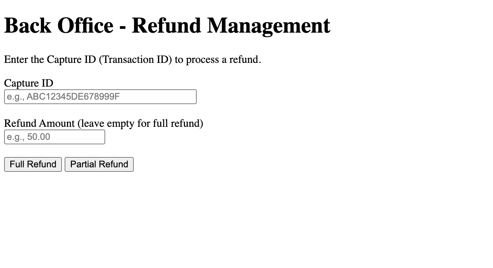
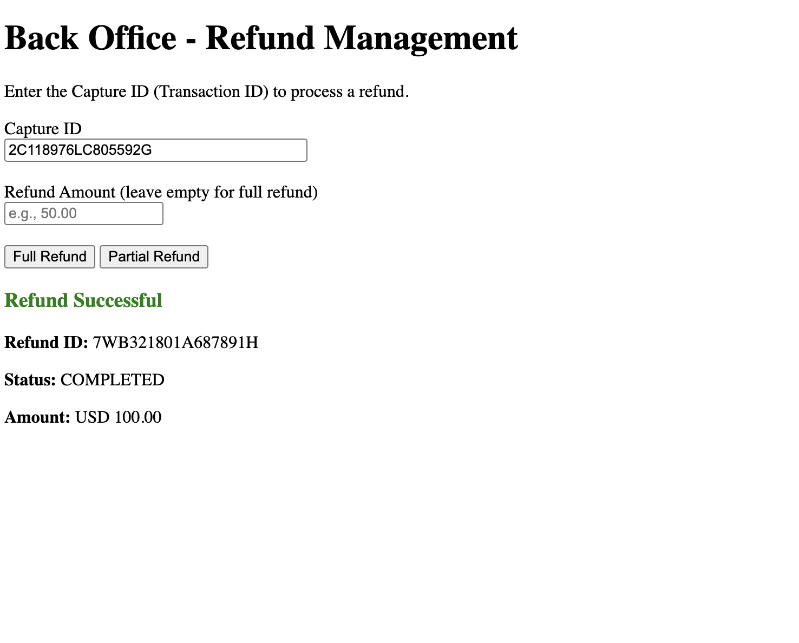
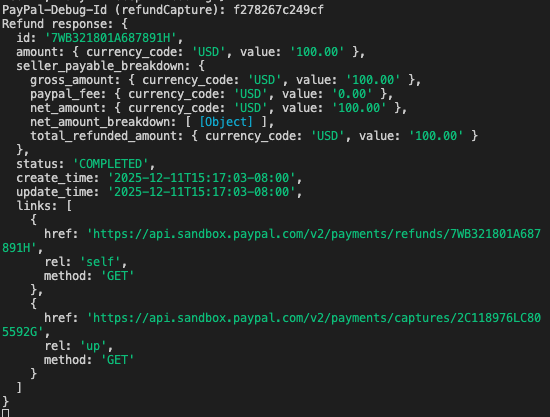
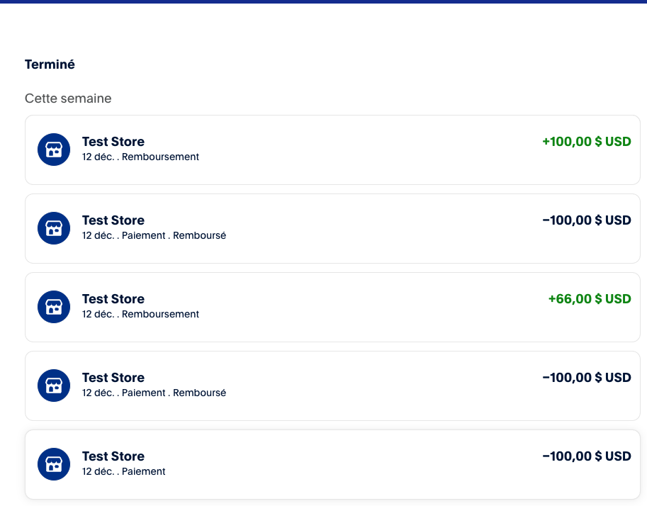
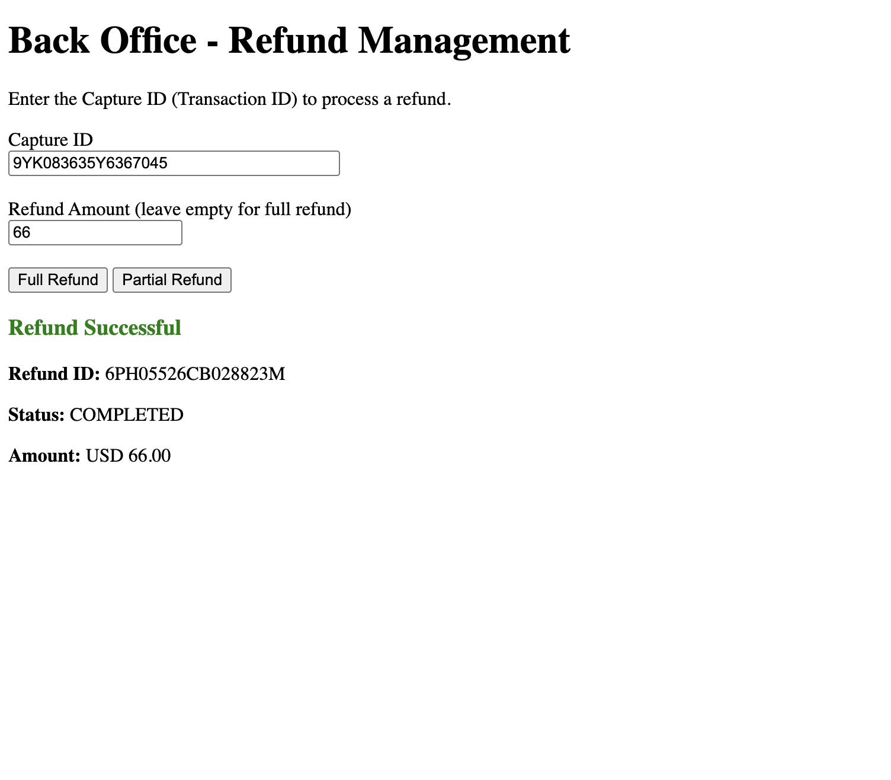
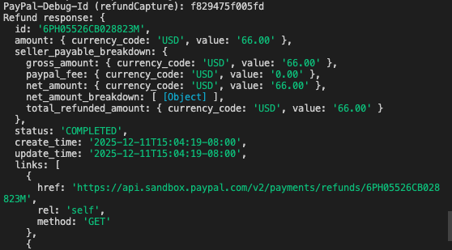
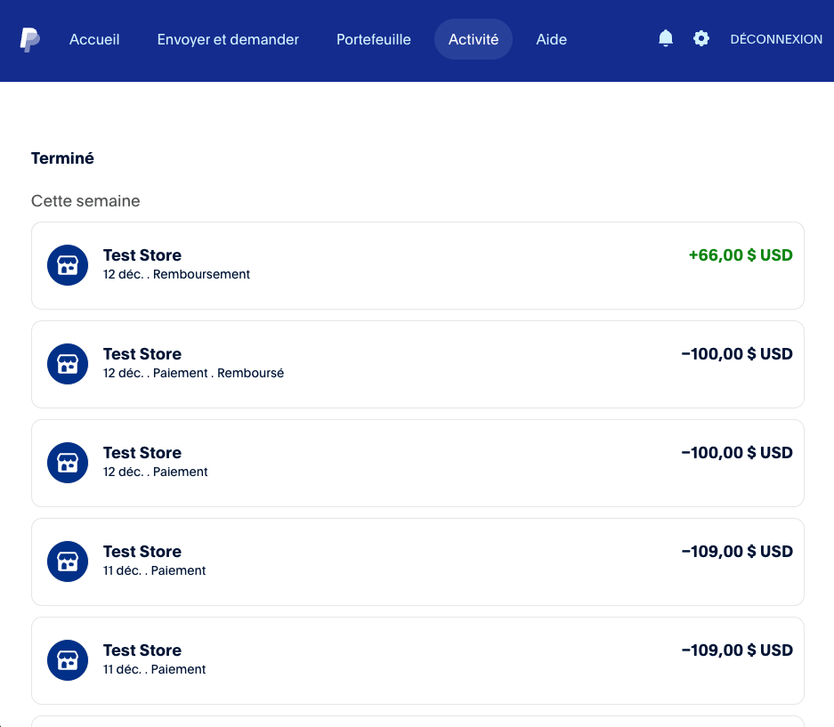

# PayPal Integration - Phase 3: Refund

## Overview

Adding refund functionality for customer service. Back-office admin page allows full or partial refunds on captured payments

New backend endpoint using PayPal Payments API v2. Frontend admin page to process refunds.

```
Admin Page → Express Route → PayPal SDK (PaymentsController) → PayPal Payments API
```

## Flow

1. Customer service gets Capture ID (Transaction ID) from previous payment
2. Opens admin page
3. Enters Capture ID
4. Chooses Full Refund or Partial Refund (with amount)
5. Backend calls `POST /v2/payments/captures/:id/refund` via SDK
6. Refund processed, Refund ID returned
7. Customer sees refund in their PayPal account

## Tech Stack

- **Frontend**: HTML, JavaScript
- **Backend**: Node.js, Express, @paypal/paypal-server-sdk (PaymentsController)
- **API**: PayPal Payments API v2

## Setup

Same as Phase 2 - no additional setup required.

### Run server

```bash
cd server/node
npm start
```

### Open admin page

```
http://localhost:8080/client/html/src/admin.html
```

## API Endpoints

New endpoint added for refunds:

`/api/orders/:captureID/refund`

### Request Body

```javascript
// Full refund - empty body
{}

// Partial refund - specify amount
{
  "amount": "50.00"
}
```

### Response

```json
{
  "id": "1JU08902781691411",
  "status": "COMPLETED",
  "amount": {
    "value": "50.00",
    "currency_code": "USD"
  }
}
```

## Screenshots

### Admin Page



### Full Refund Success





### Partial Refund Success




```

## Testing

1. Complete a payment (Phase 1 or Phase 2)
2. Note the Transaction ID (Capture ID) from success message
3. Open admin page
4. Enter Capture ID
5. Click "Full Refund" or enter amount + "Partial Refund"
6. Verify refund in Buyer Sandbox account → Activity
